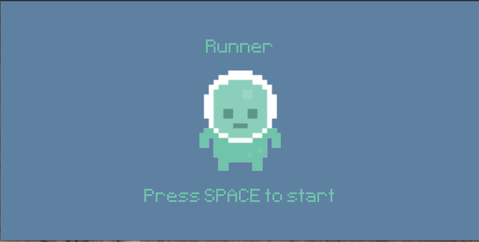
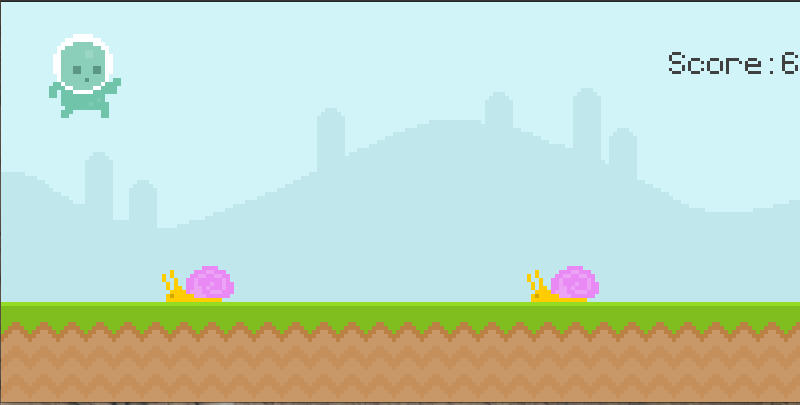

# Runner
## Basics
Runner is a game where the player has to jump or not for avoiding the approaching obstacles.

## Implementation
The game is implemented in python using pygame. It is both implemented in functional programming and object-oriented programming.

## Images
Default screen  
<!--  -->

Screen during game  

